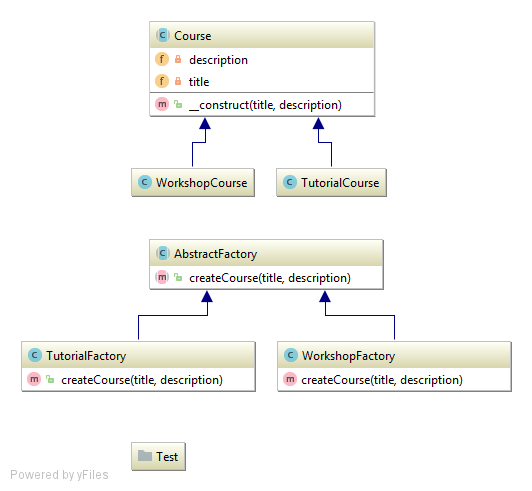

# Le pattern FactoryAbstract

Le modèle de conception FactoryAbstract offre un moyen d'encapsuler un ensemble de créateurs d'objets qui ont un thème commun 
sans spécifier leurs classes concrètes. 

